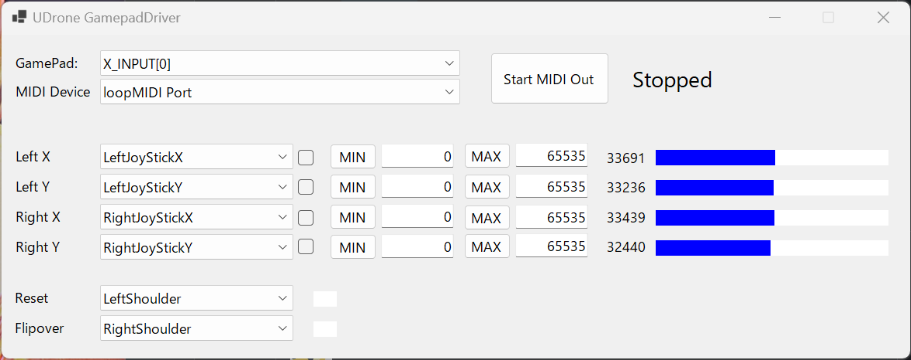
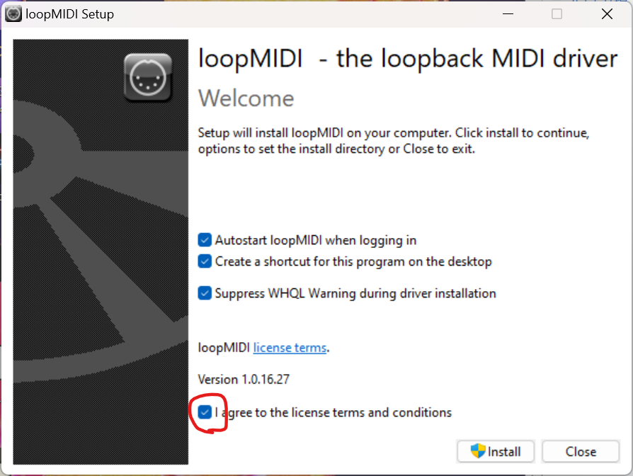
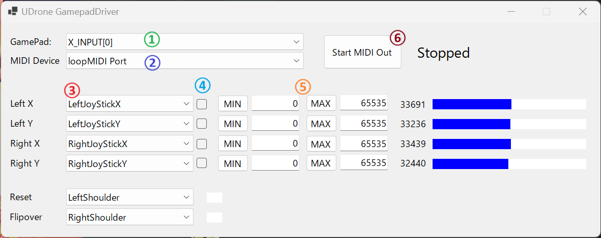

# 外部コントローラーを使用する方法

## MIDI入力（オススメ）

UDroneでプロポなどのコントローラーの外部入力を使って遊ぶ場合、こちらの方法で遊ぶのがオススメです。
カスタム入力と比較して

- 毎回の軸割り当てが不要
- デッドゾーン問題を回避
- VRCの通常の移動入力や視点入力と干渉しない
- Reset、FlipOverにボタンを割り当て可能

など様々な点で利点があります。

## MIDI入力の設定方法

MIDI入力を使用するためには以下の２つの外部ソフトウェアをインストールする必要があります。

1. [loopMIDI](https://www.tobias-erichsen.de/software/loopmidi.html)
1. [UDroneGamePadDriver](https://kurotori.booth.pm/items/3981928)

### UDroneGamePadDriver

UDroneGamePadDriverはUDroneで使用するコントローラー入力をMIDIを使用して送る専用の仲介ソフトウェアです。このソフトウェアを使うことでVRChat上でうまく使用できなかったゲームパッド、プロポを安定して使用することができます。



#### 免責事項

本ソフトウェアを使用することによって、あるいは使用できないことによって発生した損失や損害に対して作者および弊社は一切責任を負いません。
ソフトウェアの入手および利用は、利用者の自己の責任と費用により行ってください。ソフトウェアが入手できないこと、入手中および入手することによって発生した損失や損害に対して作者および弊社は一切責任を負いません。
本ソフトウェアは、なんらの予告なく変更、配布の中止をすることがあります。作者および弊社は、これらを原因として発生した損失や損害について一切責任を負いません。

### loopMIDIのインストール
loopMIDIはMIDIの仮想デバイスソフトウェアで、UDrone GamePadDriverからのMIDI信号を受信し、VRChatにMIDI信号を受け渡します。

以下のサイトにアクセスして、「download loopMIDI」をクリックし、セットアップファイルをダウンロードします。

[https://www.tobias-erichsen.de/software/loopmidi.html](https://www.tobias-erichsen.de/software/loopmidi.html)


ダウンロードが完了したらファイルを展開し、loopMIDISetup.exeを実行します。
「I agree to the license terms and conditions」にチェックを入れてインストールします。



loopMIDIを起動して以下のような表示になっていればOKです。


**loopMIDI Portが表示されない場合は、＋ボタンを押してloopMIDI Portを追加してください**

### VRChatでの設定

VRChatでMIDI信号を受け取るため、起動コマンドの設定をする必要があります。
Steamを開きVRChatの画面から「歯車マークボタン」→「プロパティ」を開きます。


プロパティの「一般」タブから起動オプションの項目に以下の内容を書き足します。

```
--midi=loopmidi
```


×ボタンで設定を閉じます。

これで導入は完了です。

### 使用方法

**必ず以下の順番で起動してください**

1. LoopMIDIを起動状態にする
1. 使用したいコントローラー・プロポをPC接続する
1. UDrone GamePadDriverを起動する
1. VRChat を起動する

**loopMIDIはどのソフトよりも最初に起動してください。** UDrone GamePadDriverやVRChatがloopMIDIを認識できません。
**UDrone GamePadDriverを起動後はコントローラーの接続状況が変わらないようにしてください。** UDrone GamePadDriverは現在起動中のコントローラーの抜き差しには対応していません。した場合エラーが発生します。

### UDrone GamePadDriverでコントローラーの設定をする



①使用するゲームパッドを選択します。XBOXコントローラーなどの`XInput`対応コントローラーは基本的に`XINPUT[0]`に割り当たっていることが多いです。`XInput`に対応していない`DirectInput`コントローラーは`XINPUT[]`以外の物を選択してください。

②接続するMIDIデバイスを選択します。ここでは`loopMIDI Port`を選択してください。`loopMIDI Port`がない場合、`loopMIDI`が起動されているか確認し、`loopMIDI`を起動後に再度`UDrone GamePadDriver`を起動してください。

③スティックとボタンの割り当てを設定する項目です。右の青いバーを見ながら正しくなるように設定してください④のチェックボックスを押すことで入力の反転ができます。

⑤コントローラーの入力幅が足りない場合は`MIN/MAX`で範囲を指定できます。
コントローラーを入力した状態で`MIN`、`MAX`ボタンを押せばその値を最小値、最大値として設定されます。

これらの設定は次回起動時も保存されます。

設定が完了したら⑥の`Start MIDI Out`を押してMIDIの送信を開始します。

### UDroneでMIDI入力モードに設定する

`Control Setting`から`Control Type`を何度か押して`MIDI`が選択されていればMIDI入力が使用可能になります。

これで設定は完了です。後は自由に飛ばすことができます。

## プリセット例

### XBoxワイヤレスコントローラー
GamePadはX_INPUT[0]を選択してください。XINPUTのコントローラーを複数繋いでいる場合はX_INPUT[]のどれかに接続されます。

Reset：左ショルダーボタン
FlipOver：右ショルダーボタン


### PS4 コントローラー
GamePad: Wireless Controller
Reset：左ショルダーボタン
FlipOver：右ショルダーボタン


### Nintendo Switch Proコントローラー
**このコントローラーの使用は正直おすすめしません。**（VRChatにフォーカスしていると入力を奪われて上手く操作できません。）

詳しくは書きませんが、HidHide などを利用してVRChatからはProコントローラーを認識させないようにするなどの工夫が必要になります。

※USB接続では正しく動作しません。**Bluetooth接続を使用してください**。

GamePad: Pro Controller
Reset：左ショルダーボタン
FlipOver：右ショルダーボタン


