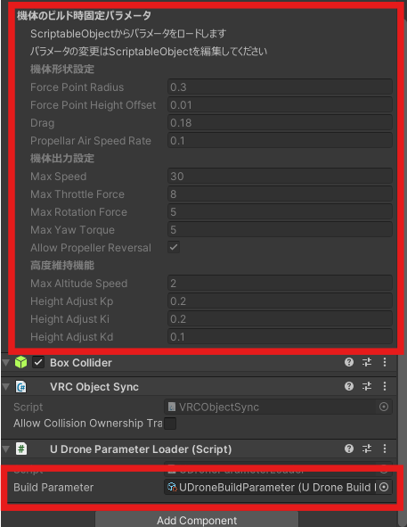
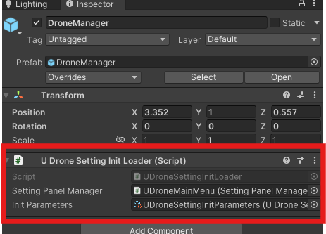

# ドローンの設定をプリセット化する

プロジェクトビューで`右クリック ＞Create > UDrone > UDroneBuildParameter`で、ドローンのパラメータのプリセットアセットを作ることができます。

`UdonDroneCore`のついているゲームオブジェクトに一緒についている`UDroneParameterLoader`にこのプリセットを設定すると、プリセットのドローンの機体設定が適用されます。

また、`DroneSettingPanel`で操作できるパラメーターの初期値を設定する場合は、`右クリック > Create > UDrone > UDroneSettingInitParameters`で同様にプリセットパラメータを作成でき、`DroneManager`プレハブの`UDroneSettingInitLoader`にセットすると初期値を簡単に変更できます。

