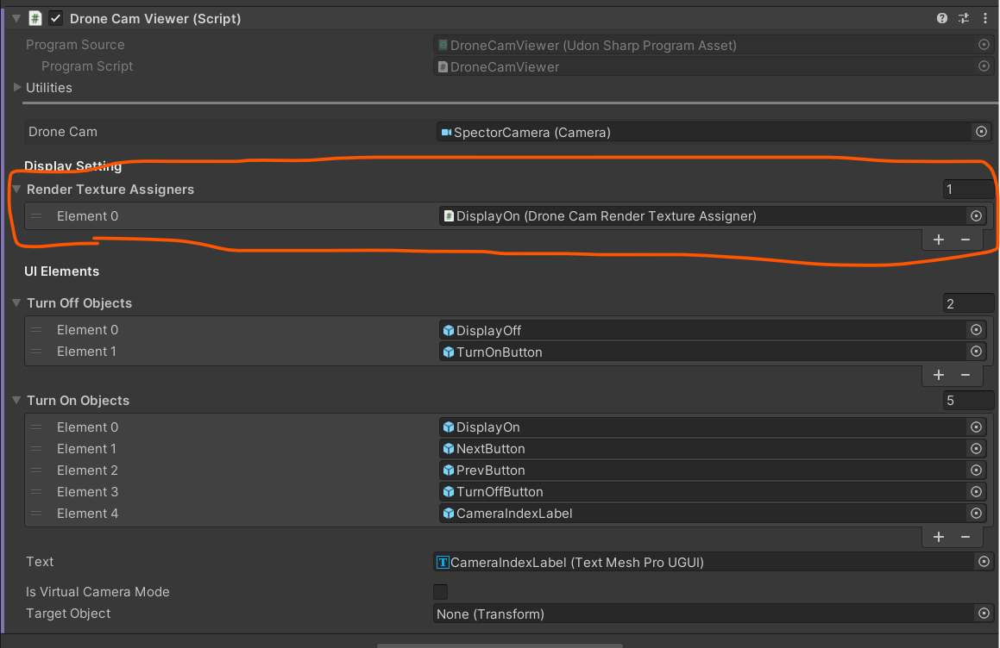
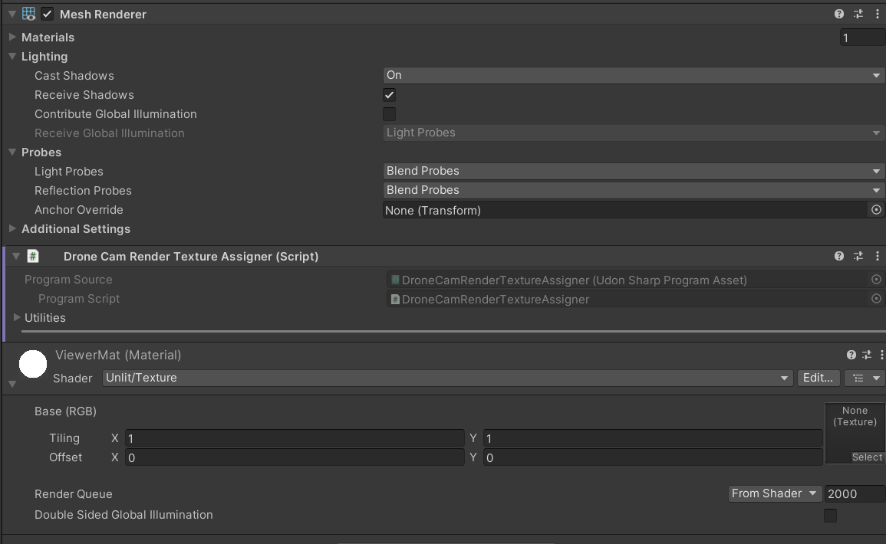

# ドローン観戦ディスプレイ

観戦ディスプレイは選択したドローンのカメラ視点や、背後からの視点を表示できるカメラ機能です。

観戦用ディスプレイは現在３種類存在します。

## DroneCamFPVViewer

選択したドローンのFPV視点を表示するカメラです。ドローンの切り替えをローカルで行えるようになります。同期の関係でカメラが激しく回転する場合があります。

## DroneCamTPVViewer

選択したドローンを三人称視点で表示するディスプレイです。カメラの切り替えはローカルで行えます。

## SyncDroneCamFPVViewer

選択したドローンのFPV視点を表示するカメラで、DroneCamViewerと違い、ドローンの切り替えはグローバルになります。同期によりカメラが激しく動いてしまう問題を軽減します。

これらの観戦ディスプレイはシーンにいくつ置いてもOKです。

# 観戦カメラの映像を別のオブジェクトに映したいとき

ビューワー系のUdonにはRender Texture Assignersという項目があります。

ここに、MeshRendererが存在するオブジェクトにDroneCamRenderTextureAssignerというUdonをアタッチしたオブジェクトをセットすることでそのメッシュのマテリアルに映像のテクスチャを渡すことができます

