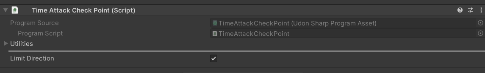

# UDroneをワールドに導入する

## ワールドへのインポートと配置

1. Unity2022で作成したワールドプロジェクトを作成します。
1. `UDrone_v2.0.unitypackage`をインポートします
1. `Assets/UdonDrone/Prefabs`以下の`DroneManager`プレハブをワールドに設置します（**シーンには一つだけ置いてください**）。
1. `Assets/UdonDrone/Prefabs`以下の`DroneSet`を欲しい台数分設置します。

## 観戦ディスプレイを配置する

観戦用ディスプレイは現在３種類存在します。

`DroneCamFPVViewer`

選択したドローンのFPV視点を表示するカメラです。ドローンの切り替えをローカルで行えるようになります。同期の関係でカメラが激しく回転する場合があります。

`DroneCamTPVViewer`

選択したドローンを三人称視点で表示するディスプレイです。カメラの切り替えはローカルで行えます。

`SyncDroneCamFPVViewer`

選択したドローンのFPV視点を表示するカメラで、DroneCamViewerと違い、ドローンの切り替えはグローバルになります。同期によりカメラが激しく動いてしまう問題を軽減します。

これらの観戦ディスプレイはシーンにいくつ置いてもOKです。

### 観戦カメラの映像を別のオブジェクトに映したいとき

ビューワー系のUdonにはRender Texture Assignersという項目があります。

ここに、MeshRendererが存在するオブジェクトにDroneCamRenderTextureAssignerというUdonをアタッチしたオブジェクトをセットすることでそのメッシュのマテリアルに映像のテクスチャを渡すことができます

### タイムアタックトラックを設定する

`TimeAttackManager`をシーンに追加します。このプレハブは１つだけ設置してください。このプレハブにはタイムアタックを管理する機能が入っています。

次に、`TimeAttackTrack`をシーンに追加します。`Checkpoints`に`Time Attack Check Point`のUdonがアタッチされたオブジェクトを指定し、コースを設定できます。

`Time Attack Check Point`では`Limit Direction`を有効にするとこのオブジェクトのZ軸方向に沿った向きでドローンが侵入しないと判定されないようにできます。

`TimeAttackLogPanel`はプレイヤーのベストラップタイムとベストレコードをログとして出力するパネルです。シーンに追加するだけで機能します。

周回数は`TimeAttackTrack`の`Max Lap`から設定できます。

## その他ユーティリティ

### ResetAllDroneButton
ワールドに設置されているすべてのドローンをリセットするボタンです。シーン上に配置するだけで使えます。

### InputChacker
全てのコントローラー入力を可視化するデバッグ用オブジェクトです。
シーン上に配置するだけで使えます。

## ドローンの色変更
ドローンの色変更は`UdonDroneCore`の`DroneColor`で設定できます。カラーはエディタ再生時に設定されます。

独自に追加したメッシュのマテリアルに同じ色をつけたい場合は、`UDrone/UDrone`の`Drone Color Applier`に指定したいメッシュを追加します。

