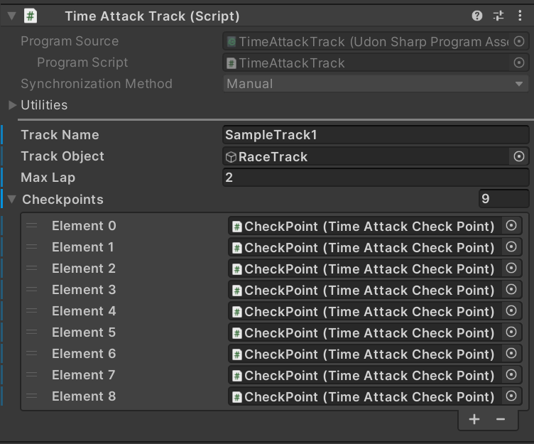
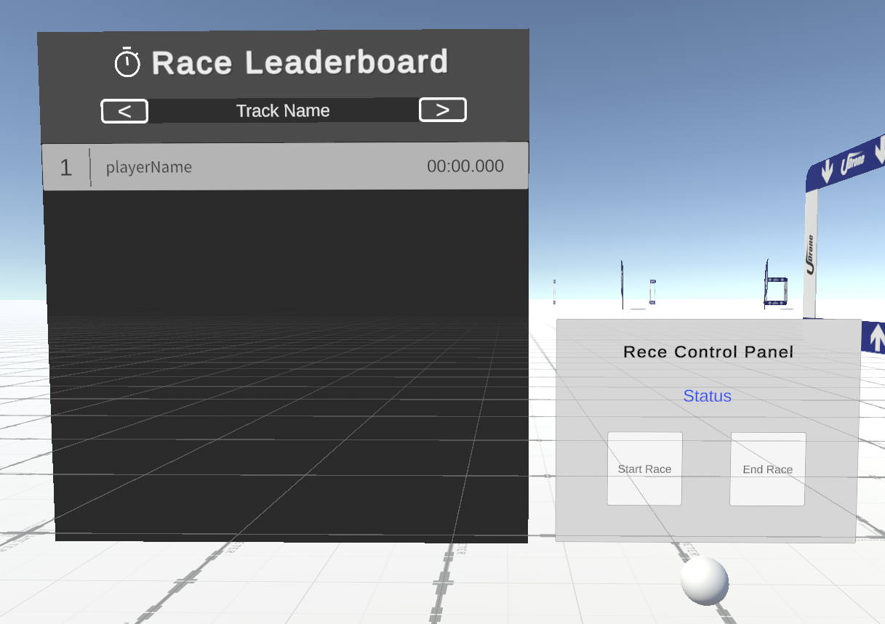
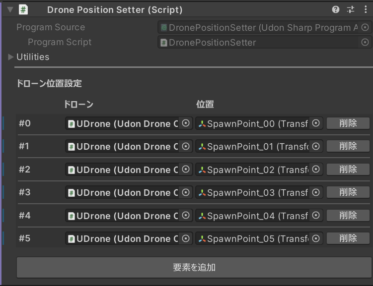

# タイムアタック機能

コースを設定することでタイムアタックやレース機能をワールドに実装することができます。
UDroneだけでなくVRC Droneにも対応しています。

## 導入方法

`DroneManager`プレハブが配置されたワールドに`Assets/UdonDrone/Prefabs/TimeAttack/TimeAttackManager.prefab`を**1つだけ**配置してください。

次に、`Assets/UdonDrone/Prefabs/TimeAttack/TimeAttackTrack.prefab`を設置します。

## タイムアタックトラックの設定

`Assets/UdonDrone/Prefabs/TimeAttack/TimeAttackTrack.prefab`をシーンに配置します。このプレハブの`Time Attack Track`というコンポーネントに対して、トラックの設定をしていきます。

`Assets/UdonDrone/Prefabs/Gates/`以下の`Gate`や`UDrone_Flag`を置いてコースを作ります。これらはチェックポイントで、コースで必ず通るポイントです。

配置し終わったら`TimeAttacTrack`の`Checkpoints`に通したい順番で設定することでコースとなります。

最後に`Time Attack Track`を`Time Attack Manager`コンポーネントの`Tracks`に追加すればコースとして機能します。

`Time Attack Track`はシーン内に複数配置可能です。またコースを構成するチェックポイントオブジェクトは`Track Obj`以下に配置してください。

`Track Name`で表示するトラック名を設定できます。

`Max Lap`で周回数を設定できます。

`Track Obj`はトラックを切り替えたときに表示非表示が切り替わるオブジェクトです。チェックポイントオブジェクトはこのオブジェクト以下に配置しましょう。

## レースシステム

同時カウントダウンと計測機能があるレースシステムです。**現在はUDroneの計測にだけ対応**してます。
`Assets/UdonDrone/Prefabs/RaceSystem/RaceSystem.prefab`をタイムアタックが設定されているワールドに配置するだけで機能します。

コントロールパネルのStart Raceを押すと、３秒後に全員同期でカウントダウンが開始され、スタート後に指定したコースでゴールするとタイムが記録されます。
注意点として、Race Leaderboardのコースを変更しても、ローカルのコース表示は切り替わらないのでレースに参加する人は個別にコース変更してもらう必要があります。

### Position Setter
`Assets/UdonDrone/Prefabs/RaceSystem/PositionSetter.prefab`というプレハブです。

指定したドローンの位置を変更する機能を追加できます。レース開始台に配置するのに使えます。
`Set Drone Position`というボタンを押すとドローンの位置が変わります。

