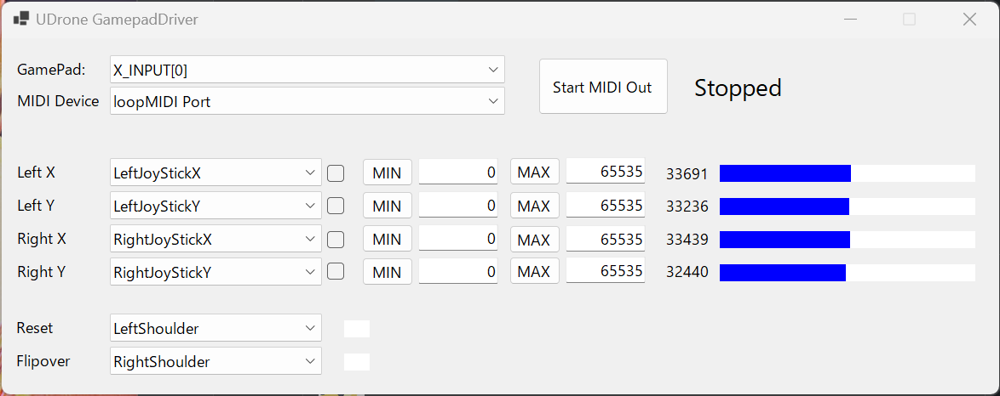
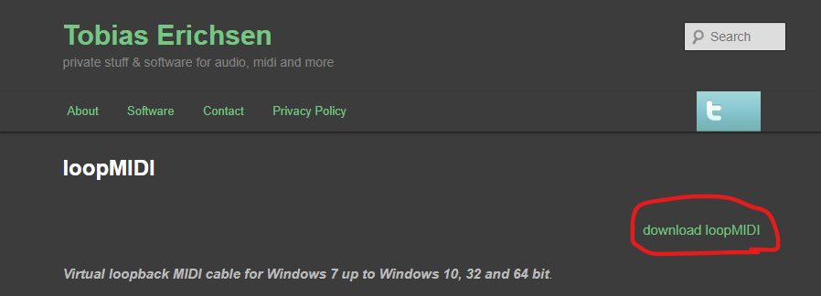
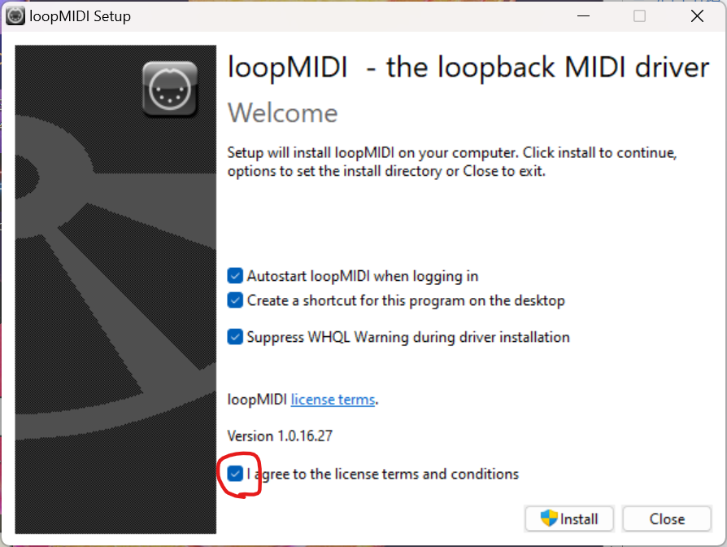
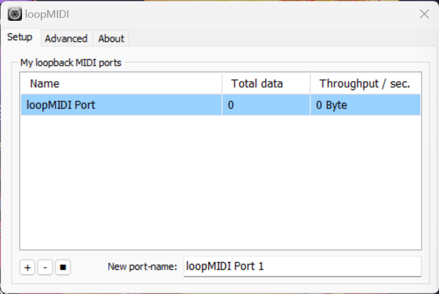
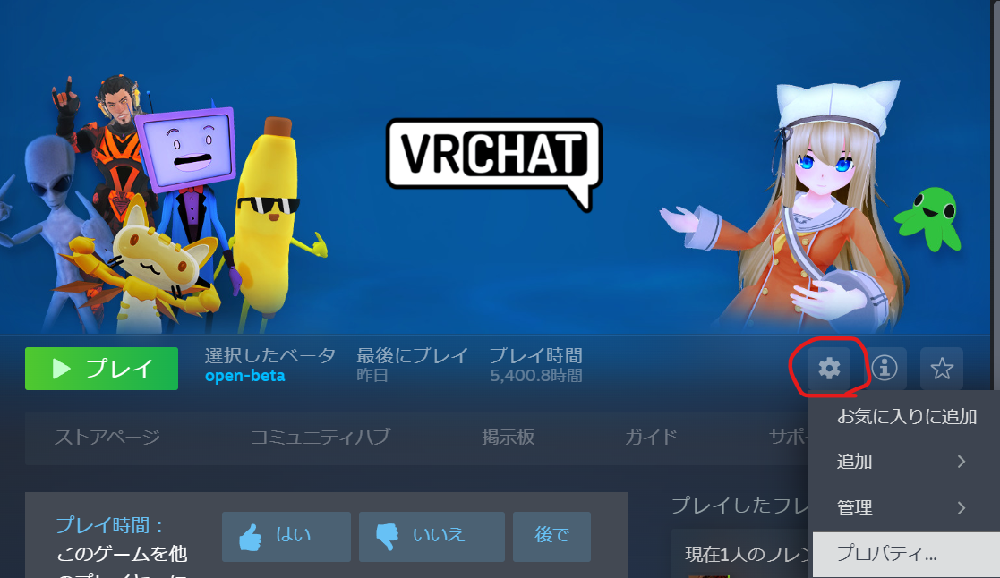
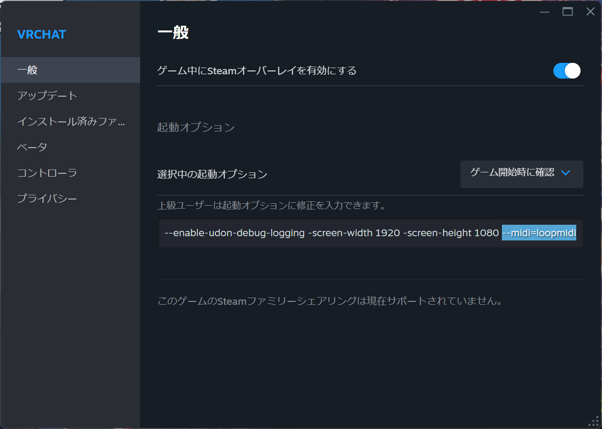
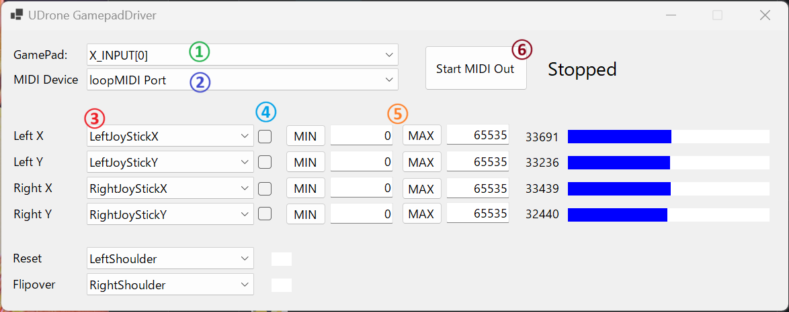
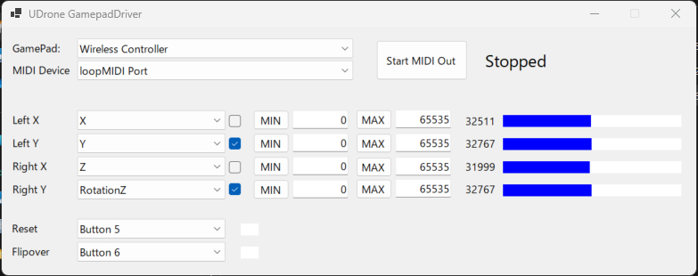
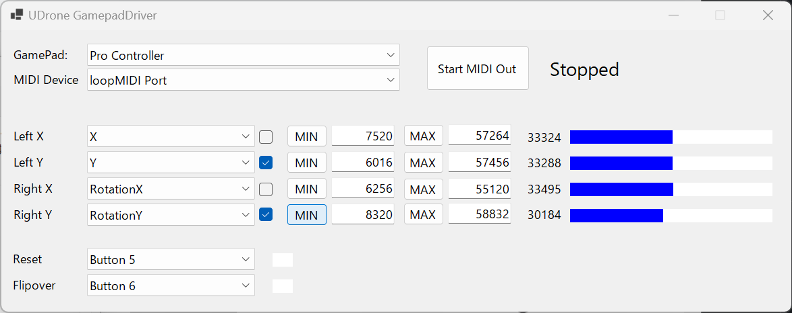

# How to Use External Controllers

## MIDI Input (Recommended)

When playing UDrone with external inputs such as transmitters or controllers, this method is recommended.
Compared to custom input, it has various advantages such as:

- No need to assign axes every time
- Avoids deadzone issues
- Does not interfere with VRC's normal movement input or view input
- Ability to assign buttons to Reset and FlipOver functions

## How to Set Up MIDI Input

To use MIDI input, you need to install the following two external software:

1. [loopMIDI](https://www.tobias-erichsen.de/software/loopmidi.html)
1. [UDroneGamePadDriver](https://kurotori.booth.pm/items/3981928)

### UDroneGamePadDriver

UDroneGamePadDriver is a dedicated intermediary software that sends controller input for UDrone using MIDI. This software allows you to use gamepads and transmitters that didn't work well in VRChat in a stable manner.



#### Disclaimer

The author and our company are not responsible for any loss or damage caused by the use or inability to use this software.
Obtaining and using the software is at the user's own risk and expense. The author and our company are not responsible for any loss or damage caused by the inability to obtain the software, during acquisition, or by obtaining it.
This software may be changed or discontinued without any notice. The author and our company are not responsible for any loss or damage caused by these changes.

### Installing loopMIDI
loopMIDI is a virtual MIDI device software that receives MIDI signals from UDrone GamePadDriver and passes them to VRChat.

Access the following site, click on "download loopMIDI", and download the setup file:

[https://www.tobias-erichsen.de/software/loopmidi.html](https://www.tobias-erichsen.de/software/loopmidi.html)



After downloading, extract the file and run loopMIDISetup.exe.
Check "I agree to the license terms and conditions" and install.



If loopMIDI starts up with the following display, you're good to go.



**If loopMIDI Port is not displayed, press the + button to add a loopMIDI Port**

### VRChat Settings

To receive MIDI signals in VRChat, you need to configure the launch command.
Open Steam and from the VRChat screen, click "Settings" (gear icon) → "Properties".



In the "General" tab of Properties, add the following to the launch options:

```
--midi=loopmidi
```



Close the settings by clicking the X button.

This completes the installation.

### How to Use

**Please start the applications in the following order:**

1. Start loopMIDI and keep it running
1. Connect the controller or transmitter you want to use to the PC
1. Launch UDrone GamePadDriver
1. Launch VRChat

**Always start loopMIDI before any other software.** UDrone GamePadDriver and VRChat will not be able to recognize loopMIDI otherwise.
**After launching UDrone GamePadDriver, please ensure that the controller connection status does not change.** UDrone GamePadDriver does not currently support plugging or unplugging controllers while running. Doing so will cause errors.

### Configuring Controllers in UDrone GamePadDriver



① Select the gamepad you want to use. `XInput` compatible controllers like Xbox controllers are typically assigned to `XINPUT[0]`. For `DirectInput` controllers that do not support `XInput`, select something other than `XINPUT[]`.

② Select the MIDI device to connect to. Choose `loopMIDI Port` here. If `loopMIDI Port` is not available, check if `loopMIDI` is running, and after starting `loopMIDI`, restart `UDrone GamePadDriver`.

③ This is where you configure stick and button assignments. Set it up correctly while watching the blue bars on the right. You can invert inputs by pressing the ④ checkbox.

⑤ If the controller's input range is insufficient, you can specify the range with `MIN/MAX`.
When you press the `MIN` or `MAX` button while inputting on the controller, that value will be set as the minimum or maximum value.

These settings will be saved for the next startup.

Once the setup is complete, press ⑥ `Start MIDI Out` to begin MIDI transmission.

### Setting UDrone to MIDI Input Mode

From `Control Setting`, press `Control Type` several times until `MIDI` is selected to enable MIDI input.

This completes the setup. Now you can freely fly.

## Preset Examples

### Xbox Wireless Controller
Select X_INPUT[0] for GamePad. If you have multiple XINPUT controllers connected, they will be connected to one of the X_INPUT[] options.

Reset: Left shoulder button
FlipOver: Right shoulder button


### PS4 Controller
GamePad: Wireless Controller
Reset: Left shoulder button
FlipOver: Right shoulder button




### Nintendo Switch Pro Controller
**Using this controller is honestly not recommended.** (When VRChat has focus, it takes over the input and you can't operate it properly.)

I won't go into detail, but you'll need to use tools like HidHide to prevent VRChat from recognizing the Pro controller.

*Note: It does not work properly with USB connection. **Use Bluetooth connection**.*

GamePad: Pro Controller
Reset: Left shoulder button
FlipOver: Right shoulder button


