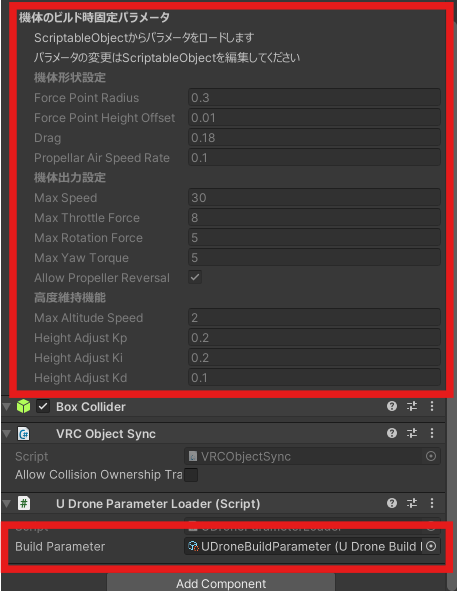
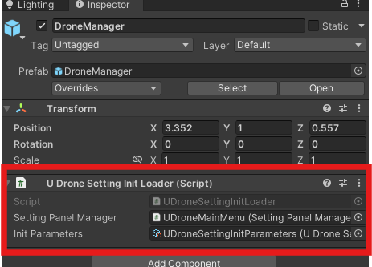

# Creating Drone Setting Presets

In the project view, you can create a preset asset for drone parameters by right-clicking and selecting `Create > UDrone > UDroneBuildParameter`.

When you set this preset in the `UDroneParameterLoader` component that is attached to the game object with `UdonDroneCore`, the drone's settings from the preset will be applied.

Also, if you want to set the initial values for parameters that can be controlled using the `DroneSettingPanel`, you can create a preset parameter in a similar way by right-clicking and selecting `Create > UDrone > UDroneSettingInitParameters`. Setting this to the `UDroneSettingInitLoader` of the `DroneManager` prefab allows you to easily change the initial values.

