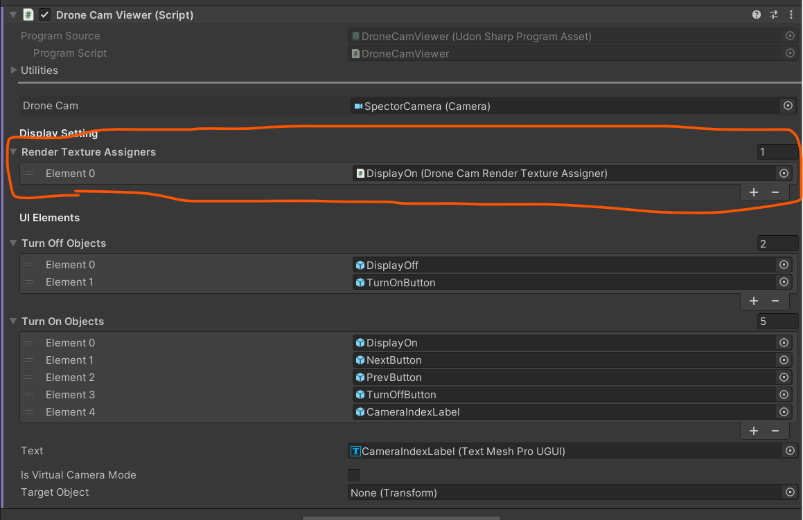
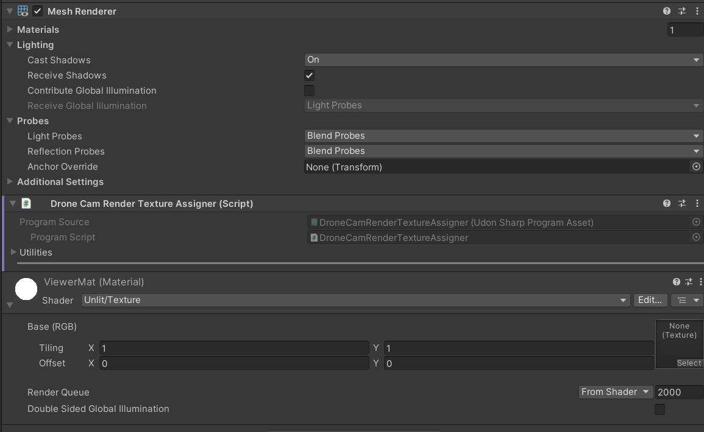
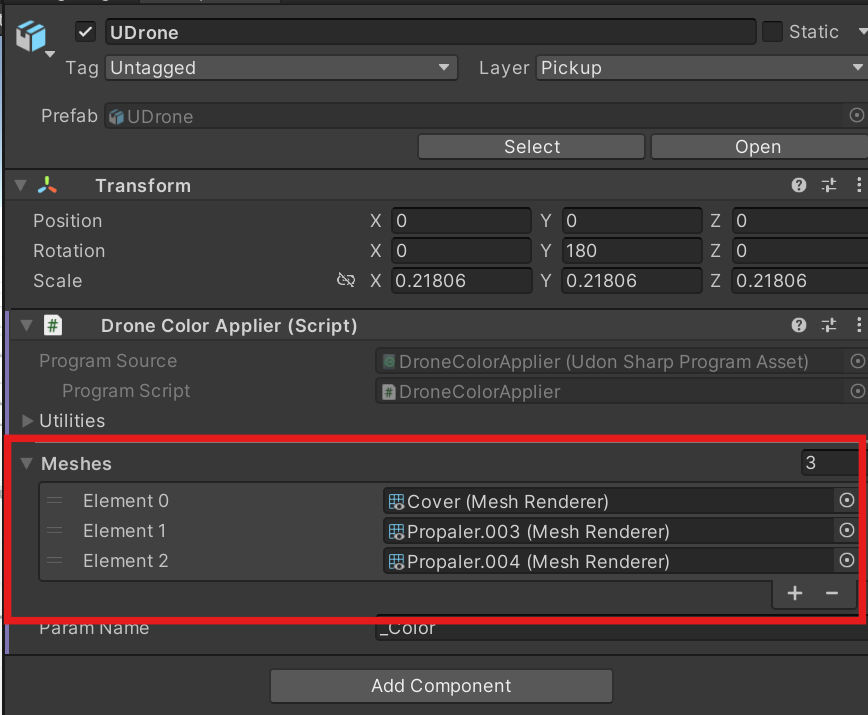

# Integrating UDrone into Your World

## Importing and Placement in Your World

1. Create a world project with Unity 2022.
1. Import the `UDrone_v2.0.unitypackage`
1. Place the `DroneManager` prefab from `Assets/UdonDrone/Prefabs` in your world (**place only one in your scene**).
1. Place as many `DroneSet` prefabs from `Assets/UdonDrone/Prefabs` as you want.

## Placing Spectator Displays

There are currently three types of spectator displays available.

`DroneCamFPVViewer`

A camera that displays the FPV view of the selected drone. You can switch drones locally. Due to synchronization issues, the camera may rotate violently at times.

`DroneCamTPVViewer`

A display that shows the selected drone in third-person view. Camera switching can be done locally.

`SyncDroneCamFPVViewer`

A camera that displays the FPV view of the selected drone, but unlike DroneCamViewer, drone switching is global. This helps reduce the issue of the camera moving violently due to synchronization.

You can place as many of these spectator displays in your scene as you want.

### Displaying Camera Feed on Other Objects

Viewer-type Udons have an item called Render Texture Assigners.

By attaching the DroneCamRenderTextureAssigner Udon to objects with a MeshRenderer and setting them here, you can pass the video texture to that mesh's material.

### Setting Up Time Attack Tracks

Add the `TimeAttackManager` to the scene. Place only one of this prefab. This prefab contains functions to manage time attacks.

Next, add the `TimeAttackTrack` to the scene. You can set up a course by specifying objects with the `Time Attack Check Point` Udon attached to the `Checkpoints`.

In `Time Attack Check Point`, you can enable `Limit Direction` to make it so that drones must enter from a direction along the Z-axis of this object to be detected.

The `TimeAttackLogPanel` is a panel that outputs the player's best lap time and best record as a log. It functions just by adding it to the scene.

The number of laps can be set from the `Max Lap` on `TimeAttackTrack`.

## Other Utilities

### ResetAllDroneButton
A button that resets all drones placed in the world. It can be used just by placing it in the scene.

### InputChacker
A debug object that visualizes all controller inputs.
It can be used just by placing it in the scene.

## Changing Drone Color
Drone color can be set in `UdonDroneCore`'s `DroneColor`. The color is set when the editor is played.

If you want to apply the same color to the material of a custom mesh, add the desired mesh to `Drone Color Applier` in `UDrone/UDrone`.

