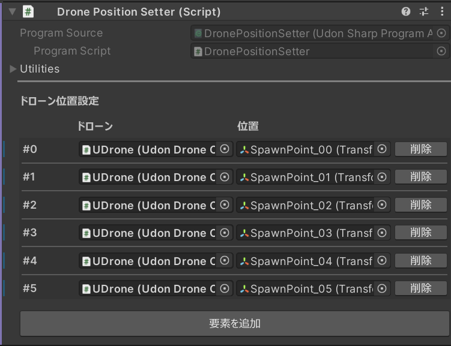

# Time Attack Feature

By configuring a course, you can implement time attack and racing features in your world.
This is compatible with not only UDrone but also VRC Drone.

## Installation

Place `Assets/UdonDrone/Prefabs/TimeAttack/TimeAttackManager.prefab` **only once** in a world where the `DroneManager` prefab is placed.

Next, place `Assets/UdonDrone/Prefabs/TimeAttack/TimeAttackTrack.prefab`.

## Configuring Time Attack Tracks

Place `Assets/UdonDrone/Prefabs/TimeAttack/TimeAttackTrack.prefab` in your scene. You'll configure the track using the `Time Attack Track` component on this prefab.

Place `Gate` or `UDrone_Flag` from `Assets/UdonDrone/Prefabs/Gates/` to create a course. These are checkpoints that must be passed on the course.

Once you've placed them, set them in the order you want them to be passed in the `Checkpoints` of `TimeAttackTrack` to form a course.

Finally, add the `Time Attack Track` to the `Tracks` of the `Time Attack Manager` component for it to function as a course.

Multiple `Time Attack Track`s can be placed in a scene. Also, place checkpoint objects under the `Track Obj`.

You can set the track name to display with `Track Name`.

You can set the number of laps with `Max Lap`.

`Track Obj` is an object that toggles visibility when you switch tracks. Place checkpoint objects under this object.

## Race System

This is a race system with simultaneous countdown and timing features. **Currently it only supports UDrone timing**.
Just place `Assets/UdonDrone/Prefabs/RaceSystem/RaceSystem.prefab` in a world with time attack configured, and it will function.

When you press Start Race on the control panel, a countdown synchronized for everyone will start after 3 seconds, and when you finish the specified course after the start, your time will be recorded.
Note that even if you change the course on the Race Leaderboard, the local course display doesn't change, so race participants need to change courses individually.

### Position Setter
This is the `Assets/UdonDrone/Prefabs/RaceSystem/PositionSetter.prefab` prefab.

It adds a function to change the position of specified drones. It can be used to place drones at the race starting position.
Pressing the `Set Drone Position` button changes the drone's position.

