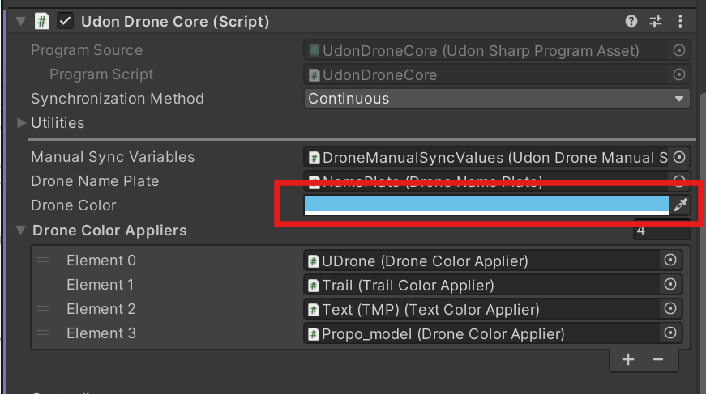

# Other Utilities

## ResetAllDroneButton
A button that resets all drones placed in the world. It can be used just by placing it in the scene.

## InputChacker
A debug object that visualizes all controller inputs.
It can be used just by placing it in the scene.

## Changing Drone Color
Drone color can be set in `UdonDroneCore`'s `DroneColor`. The color is set when the editor is played.

If you want to apply the same color to the material of a custom mesh, add the desired mesh to `Drone Color Applier` in `UDrone/UDrone`.

